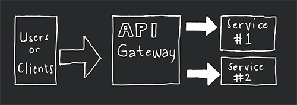

# API Gateway Template (AWS Serverless)

This is my bare project of an API Gateway providing layer of authorization, security, and centralization of requests and forwards them to microservices.

## Flow Diagram

## Technologies and Libraries
- [Node.js](https://nodejs.org/en/) (in pure JavaScript)
- [GraphQL](https://graphql.org/)
- [Apollo Server](https://www.apollographql.com/docs/apollo-server)
- [Serverless Framework](https://www.serverless.com)
- [Localstack](https://localstack.cloud)